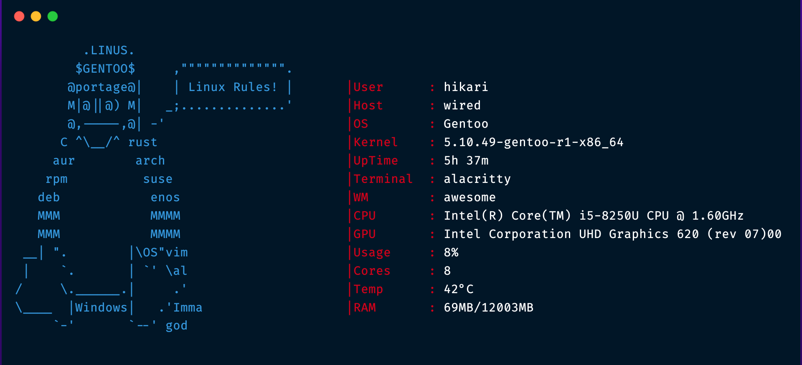

# tuxfetch🐧

1. Clone the Repository
```sh
git clone https://github.com/wiredhikari/tuxfetch
cd tuxfetch
```

2. Build it!

```sh
cargo build --release
```

3. Copy the binary(for non-root)
```sh
cp target/release/tuxfetch ~/.local/bin/tuxfetch
```
4. Run it!
```
tuxfetch
```

----------------

### [Crates.io link](https://crates.io/crates/tuxfetch)

----------------



